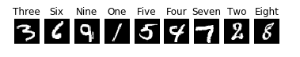
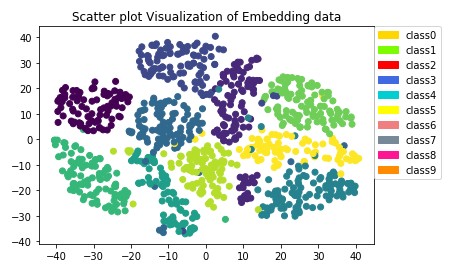
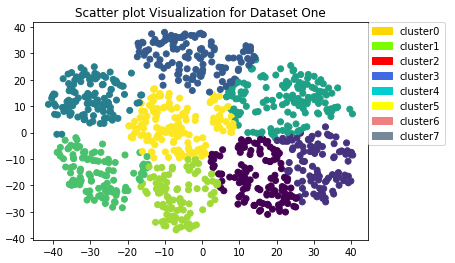
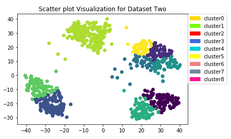
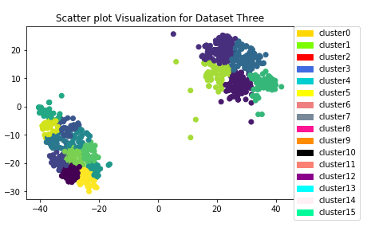

# Cluster Analysis

The focus of this project is building a **k-means** cluster algorithm from scratch without us of any publicly avaliable libraries. The algorithm is then tested using Fashion MNIST dataset.

## Clustering

Cluster analysis or clustering is the task of grouping a set of objects in such a way that objects in the same group called cluster are more similar to each other than to those in other groups or clusters. We can use clustering analysis to gain some valuable insights from our data by seeing what groups the data points fall into when we apply a clustering algorithm

|  |  |
| :-------------------------------------------: | :----------------------------------------: |

There are two main types of classification:

    - k-means clustering
    - Hierarchical clustering

## k-means Clustering

k-means is one of the simplest unsupervised learning algorithms that solve the well known clustering problem. The procedure follows a simple and easy way to classify a given data set through a certain number of clusters (assume k clusters) fixed apriori. The main idea is to define k centers, one for each cluster. These centers should be placed in a cunning way because of different location causes different result. So, the better choice is to place them as much as possible far away from each other. The next step is to take each point belonging to a given data set and associate it to the nearest center. When no point is pending, the first step is completed and an early group age is done. At this point we need to re-calculate k new centroids as barycenter of the clusters resulting from the previous step. After we have these k new centroids, a new binding has to be done between the same data set points and the nearest new center. A loop has been generated. As a result of this loop we may notice that the k centers change their location step by step until no more changes are done or in other words centers do not move any more. Finally, this algorithm aims at minimizing an objective function know as squared error

### pseudocode:

- Input dataset D, with k no of clusters
- Initialize cluster representatives C
- Randomly choose k data points from D
- Use k points as initial set of cluster representatives C
- repeat
  - Reassign points in D to closest cluster mean
  - Update m such that m_i is cluster ID of ith point in D
- Updat C such that c_i is mean of points in jth cluster until convergence

|  |  |  |
| :---------------------------------------: | :------------------------------------: | -------------------------------------- |

